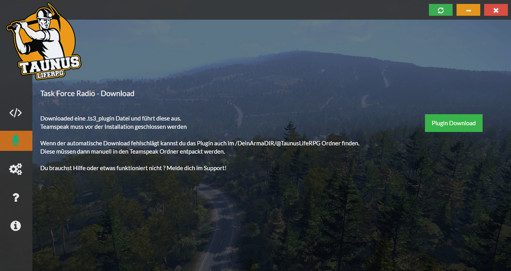

# TaunuslifeRPG Launcher

Willkommen auf dem Repoistory zum offiziellen ArmA 3 TaunuslifeRPG Launcher.

**ACHTUNG!** Dieses Projekt wurde eingestellt und wird nicht weiterentwickelt!

## Preview

## Tools
[ModUpdateScripts](https://github.com/lukas-fichtner/ModUpdateScripts)
Für die Server Mod Updates

## Credits

**Ein besonderer Dank geht an [Kaibu](https://github.com/kaibu) mit seinem Projekt [RealLifeRPGLauncher](https://github.com/A3ReallifeRPG/RealLifeRPGLauncher)! Auf seinem Projekt basiert auch dieser Launcher.**

Der TaunuslifeRPG Launcher basiert auf [Electron](http://electron.atom.io/) und ist daher eine reine HTML, Javascript und CSS Anwendung.

Vielen Dank auch an alle Entwickler der verschiedenen Bibilotheken, eine genaue Liste findet ihr in der `package.json` die Bibilotheken selber auf [NPM](https://www.npmjs.com/)

## License

The Launcher is licensed under the [GNU General Public License version 3](https://opensource.org/licenses/GPL-3.0)